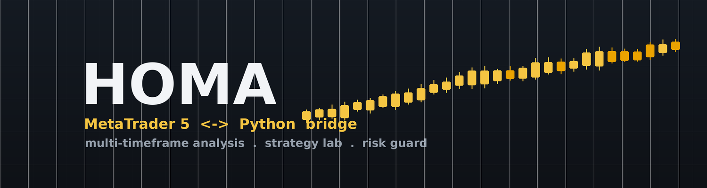
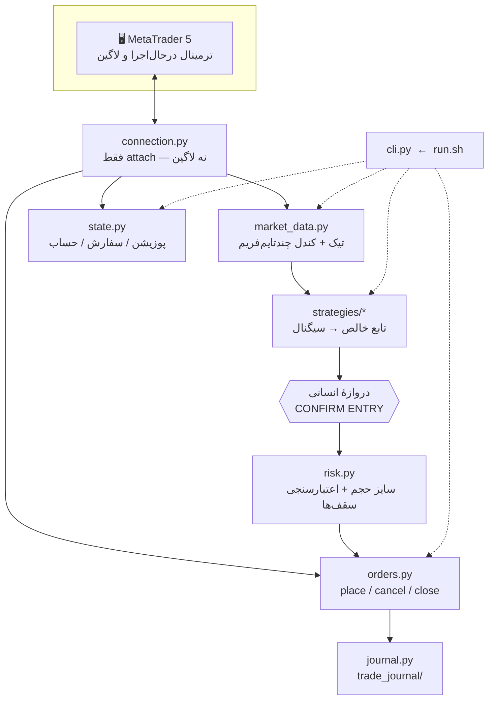

<div align="center">



<h1>هُما &nbsp;•&nbsp; HOMA Bridge</h1>

<p><b>پلی بین MetaTrader 5 و پایتون</b><br/>
تحلیل چند‌تایم‌فریم، آزمایشگاه استراتژی، بک‌تست و ژورنال معاملات — با یک لایهٔ محافظ ریسک که جلوی سفارش خارج از قاعده را می‌گیرد.</p>

<p>


</p>

</div>

---

<div dir="rtl">

> **هُما** پرنده‌ای اسطوره‌ای است که هرگز فرود نمی‌آید و همیشه در اوج پرواز می‌کند؛ گفته‌اند سایه‌اش بر هر که بیفتد به او اقبال می‌رسد. این پروژه هم قرار است بازار را از بالا ببیند: تحلیل از تایم‌فریم بالا به پایین، تصمیم مکانیکی، و اجرای محتاط.

## فهرست

- [هُما چیست؟](#هما-چیست)
- [ویژگی‌ها](#ویژگیها)
- [معماری](#معماری)
- [پیش‌نیازها](#پیشنیازها)
- [نصب و راه‌اندازی](#نصب-و-راهاندازی)
- [استفاده — خط فرمان](#استفاده--خط-فرمان)
- [استراتژی‌ها](#استراتژیها)
- [پروتکل ریسک](#پروتکل-ریسک)
- [ژورنال معاملات](#ژورنال-معاملات)
- [ساختار پروژه](#ساختار-پروژه)
- [نقشهٔ راه](#نقشهٔ-راه)
- [سلب مسئولیت](#سلب-مسئولیت)
- [لایسنس](#لایسنس)

---

## هُما چیست؟

یک بستهٔ پایتون سبک که به یک ترمینال **در‌حال‌اجرا و لاگین‌شدهٔ** MetaTrader 5 وصل می‌شود
(هیچ‌وقت خودش لاگین نمی‌کند و ترمینال دوم بالا نمی‌آورد) و روی آن سه کار انجام می‌دهد:

1. **می‌خواند** — تیک زنده و کندلِ چند تایم‌فریم به‌صورت یک‌جا (M1 تا D1)، وضعیت حساب، پوزیشن‌ها و سفارش‌های باز.
2. **تصمیم می‌گیرد** — استراتژی‌ها توابع خالصی هستند که فقط یک «سیگنال» پیشنهاد می‌دهند؛ هرگز مستقیماً سفارش نمی‌گذارند.
3. **اجرا می‌کند** — لایهٔ سفارش، پیش از هر اجرا ظرفیت، مجوز ترید، ساختار قیمت و ریسک/ریوارد را دوباره اعتبارسنجی می‌کند و اگر چیزی خارج از قاعده باشد سفارش را **رد می‌کند** (`"ok": false`)، نه اینکه فقط هشدار بدهد.

همهٔ تعامل‌ها از یک نقطهٔ ورود واحد رد می‌شوند: `./run.sh`.

---

## ویژگی‌ها

| | |
|---|---|
| 🔌 **اتصال بدون‌مزاحمت** | به ترمینال در‌حال‌اجرا وصل می‌شود؛ یک session، هر تعداد تایم‌فریم. |
| 📊 **تحلیل بالا‌به‌پایین** | `analyze gold --tf M1 M5 M15 H1 H4 D1` در یک فراخوانی. |
| 🧠 **آزمایشگاه استراتژی** | استراتژی = تابع خالص روی دیکشنری کندل‌ها؛ افزودن استراتژی جدید، لایهٔ اجرا را دست نمی‌زند. |
| 🛡️ **محافظ ریسک سخت‌گیر** | حجم بر اساس ریسک محاسبه می‌شود؛ سقف ضرر/سود، سقف حجم و سقف پوزیشن باز در لحظهٔ اجرا چک می‌شوند. |
| 🎯 **استثناء پوزیشن بلندمدت** | تیکت‌های سوئینگ با مجیک جدا، از شمارش پوزیشن اسکلپ مستثنی‌اند و سقف ریسک مخصوص خود دارند. |
| 📓 **ژورنال ساختارمند** | هر معاملهٔ بسته‌شده در `trade_journal/YYYY-MM-DD/` با CSV + یادداشت درس‌ها. |
| 🧪 **بک‌تست ۱۰۰ روزه** | گزارش‌های فارسیِ هر استراتژی روی دادهٔ واقعی M1 در `backtest_reports/`. |
| 🔒 **بدون داده حساس در مخزن** | لاگین/سرور/کارگزار از متغیر محیطی؛ `.env` و ژورنال گیت‌ایگنور. |

---

## معماری



**اصل طراحی:** استراتژی‌ها از اجرا جدا هستند. یک استراتژی فقط یک `dict` سیگنال برمی‌گرداند
و هیچ‌گاه `mt5` یا `orders` را صدا نمی‌زند. این یعنی استراتژی‌ها بدون اتصال زنده و روی
دادهٔ تاریخی قابل تست‌اند، و اضافه/عوض‌کردنشان به لایهٔ `config`/`orders` دست نمی‌زند.

</div>

---

<div dir="rtl">

## پیش‌نیازها

- یک نصب MetaTrader 5 که **بالا و لاگین** باشد و در آن **Algo/Expert Trading روشن** باشد.
- پایتونی که پکیج رسمی `MetaTrader5` را دارد:
  - **لینوکس:** MT5 زیر Wine + یک **پایتون ویندوزی ۳.۱۱** داخل همان Wine prefix.
  - **ویندوز:** پایتون ۳.۱۱ معمولی.
- `numpy==1.26.4` — نسخهٔ جدیدتر زیر Wine به‌خاطر نبودِ `ucrtbase.dll.crealf` هنگ می‌کند.

</div>

> [!WARNING]
> زیر Wine حتماً `numpy` را روی `1.26.4` پین کنید. با نسخهٔ جدیدتر، `mt5.initialize()`
> بی‌صدا هنگ می‌کند (نه ارور، نه خروجی).

<div dir="rtl">

## نصب و راه‌اندازی

```bash
git clone https://github.com/AmirHaddadi/homa-bridge.git
cd homa-bridge
cp .env.example .env          # مقادیر را برای دستگاه خودت پر کن
```

### پایتونِ داخل Wine (مسیر لینوکس)

```bash
# داخل Wine prefixی که ترمینال در آن است:
wine python.exe -m pip install --upgrade pip
wine python.exe -m pip install MetaTrader5 "numpy==1.26.4"
```

پایتونِ embeddable ویندوز `sys.path` را محدود می‌کند؛ برای اینکه `python -m mt5bridge.cli`
پکیج را پیدا کند، یک خط `..` به فایل `pythonXYZ._pth` اضافه کنید تا ریشهٔ `C:\` در
مسیر باشد. ساده‌ترین کار این است که پوشهٔ `mt5bridge/` پروژه را به `drive_c` **سیم‌لینک**
کنید تا یک منبع حقیقت داشته باشید:

```bash
ln -s "$(pwd)/mt5bridge" "$WINEPREFIX/drive_c/mt5bridge"
```

### تنظیم `.env`

| کلید | توضیح |
|---|---|
| `MT5_WINEPREFIX` | Wine prefix حاوی ترمینال؛ **خالی بگذارید** تا با `python3` بومی اجرا شود. |
| `MT5_WINE_PYTHON` | مسیر `python.exe` نسبت به `drive_c` (پیش‌فرض `../Python311/python.exe`). |
| `MT5_TERMINAL_PATH` | مسیر ویندوزیِ `terminal64.exe`. |
| `MT5_COMPANY` / `MT5_SERVER` / `MT5_LOGIN` | فقط اطلاعاتی — بریج لاگین نمی‌کند. |

### تست دود

```bash
./run.sh state          # باید حساب/پوزیشن‌ها را JSON چاپ کند
./run.sh tick gold      # bid/ask زنده
```

</div>

---

<div dir="rtl">

## استفاده — خط فرمان

همه‌چیز از `./run.sh` می‌گذرد (که در واقع `python -m mt5bridge.cli` است).

</div>

| دستور | کار |
|---|---|
| `./run.sh state` | پوزیشن‌ها + سفارش‌های در انتظار + اطلاعات حساب (با تفکیک اسکلپ/بلندمدت) |
| `./run.sh tick gold` | bid/ask زنده و مشخصات نماد (`gold`, `xau`, `ndx`, `nasdaq`, `eur` → نماد دقیق بروکر) |
| `./run.sh analyze gold --tf M1 M5 M15 H1 H4 D1 --count 30` | اسنپ‌شات چند‌تایم‌فریم در یک session |
| `./run.sh symbols nas` | جستجوی فهرست نمادهای بروکر با کلیدواژه |
| `./run.sh signal amir_trade_premium gold` | ارزیابی یک استراتژی روی دادهٔ زنده — فقط پیشنهاد، هرگز سفارش |
| `./run.sh place gold --type buy_limit --entry 4290 --sl 4275 --tp 4590` | سفارش در انتظار؛ سقف‌های پروتکل اجباری |
| `./run.sh place gold --type buy_limit --entry 4280 --sl 4260 --tp 4592 --long-term` | سفارش سوئینگ بلندمدت (مجیک جدا، مستثنی از سقف پوزیشن) |
| `./run.sh cancel <ticket>` | لغو سفارش در انتظار |
| `./run.sh close <ticket>` | بستن پوزیشن باز با قیمت بازار |
| `./run.sh history <ticket>` | دیل‌های یک پوزیشن (برای ژورنال) |
| `./run.sh burn-leg <strategy> <symbol> "<leg_start>"` | علامت‌زدن یک لِگ استاپ‌خورده تا دوباره سیگنال نشود |
| `./run.sh draw ob gold "<t1>" <p1> "<t2>" <p2> --kind bear` | مستطیل اردر بلاک روی چارت |
| `./run.sh draw line gold "<t1>" <p1> "<t2>" <p2> --kind bear` | خط روند |
| `./run.sh draw hline gold <price> --label "SL"` | خط افقی قیمت |
| `./run.sh draw tri\|ellipse\|vline\|text ...` | اشکال هندسی / یادداشت |
| `./run.sh draw list` / `rm <id>` / `clear [--symbol gold]` | مدیریت اشکال |

<div dir="rtl">

### نمونه: چرخهٔ کامل

```bash
./run.sh analyze gold --tf M15 M5 M1              # ۱) تحلیل بالا‌به‌پایین
./run.sh signal amir_trade_premium gold           # ۲) گرفتن پیشنهاد استراتژی
./run.sh place gold --type buy_stop \
    --entry 4412.30 --sl 4409.10 --tp 4423.50     # ۳) اجرا (بعد از تأیید انسانی)
# ... پوزیشن بسته شد ...
./run.sh history 105108286                         # ۴) گرفتن قیمت/سود واقعی برای ژورنال
```

اگر `--lot` ندهید، حجم از روی سقف ضرر همان نماد و فاصلهٔ استاپ محاسبه و رو به پایین
گرد می‌شود (بین `0.01` تا سقف `MAX_LOT=0.03`)؛ استاپ تنگ‌تر → حجم بزرگ‌تر، همه نزدیک
یک ریسک دلاری. اگر استاپ برای سقف ریسک زیادی پهن باشد، `place` به‌جای اضافه‌ریسک‌کردن،
سفارش را رد می‌کند.

### رسم روی چارت — `HomaDraw`

`./run.sh draw ...` یک فایل `MQL5/Files/homa_draw.tsv` می‌نویسد. اکسپرت
`mql5/HomaDraw.mq5` (یک‌بار در MetaEditor کامپایل و روی یک چارت از هر نماد وصل
شود) هر ثانیه آن را می‌خواند و اشکال را می‌سازد/به‌روز/حذف می‌کند. هر آبجکت با
نام `HOMA_<id>` ساخته می‌شود؛ آبجکت‌های دیگر چارت دست‌نخورده می‌مانند. زمان‌ها به
وقت سرور و به شکل `YYYY-MM-DD HH:MM` (همان خروجی `analyze`). رنگ‌ها:
`bear`/`bull`/`neutral`/`info` یا `R,G,B`.

</div>

---

<div dir="rtl">

## استراتژی‌ها

هر سه استراتژی روی طلا (`XAUUSD!`)، سشن نیویورک، با دادهٔ واقعی M1 روی ۱۰۰ روز
(۲۷ مه تا ۴ سپتامبر ۲۰۲۶) بک‌تست شده‌اند. قوانین پروتکل (سشن، سقف ترید در روز،
استاپ روزانه) در بک‌تست اعمال شده؛ کندلی که هم SL و هم TP را زده = ضرر.

> ⚠️ این اعداد پیش از رژیم «نقطه‌زنی» ۹ سپتامبر (حجم ریسک‌محور ۰.۰۱–۰.۰۳، سقف طلا ۸$)
> گرفته شده‌اند و باید دوباره اجرا شوند.

</div>

| استراتژی | کلید CLI | ایده | مدل ریوارد | برآیند ۱۰۰ روز | تریدها | نرخ برد | بیشترین افت |
|---|---|---|:---:|:---:|:---:|:---:|:---:|
| **ترید امیر** | `amir_trade` | ادامهٔ روند بعد از پولبک کم‌عمق در لِگ فعال، استاپ ساختاری تنگ | ۳R | **‎+۵۲.۱۱$** | ۵۴ | ۳۵٪ | — |
| **ترید امیر — پرمیوم** | `amir_trade_premium` | همان ایده، ولی انتخابی‌تر: پولبک باید لیکوییدیتی را جارو کند، ماشهٔ M1 قوی‌تر | ۳.۵R | **‎+۶۵.۰۷$** | ۲۸ | ۲۹٪ | ‎−۳۵.۷۴$ |
| **گرگ وال‌استریت** | `claude_wolf` | فِیدِ شکستِ ناموفق: قیمت سطح سوئینگ را جارو می‌کند، جا نمی‌افتد، برمی‌گردد؛ با تایم‌استاپ | ۳R | ‎+۷.۹۵$ | ۱۴۵ | ۳۶٪ | ‎−۶۵.۶۲$ |

<div dir="rtl">

> پارامترهای هر استراتژی با grid-search روی همین ۱۰۰ روز تنظیم شده‌اند؛ ریسک
> overfit وجود دارد و روی دادهٔ جدید احتمالاً کمی ضعیف‌تر عمل می‌کنند.
> **پرمیوم** بهترین برآیند تاکنون است (سود بیشتر، نصفِ تعداد ترید، افت سرمایهٔ کمتر).
> **گرگ وال‌استریت** عملاً سربه‌سر است و هنوز آمادهٔ اجرای زنده نیست.

### افزودن استراتژی جدید

1. یک ماژول در `mt5bridge/strategies/` بساز که تابع
   `evaluate(snapshot, reference_time=None, news_blackouts=None) -> dict` داشته باشد
   (شکل خروجی مثل `amir_trade`).
2. آن را در `strategies/__init__.py` در دیکشنری `STRATEGIES` ثبت کن.

همین. لایهٔ اجرا، `config` و محافظ ریسک دست‌نخورده می‌مانند.

</div>

---

<div dir="rtl">

## پروتکل ریسک

مقادیر در `mt5bridge/config.py` (نه مخفی — پارامتر استراتژی). `orders.place_pending`
پیش از هر اجرا این‌ها را دوباره چک می‌کند.

### اسکلپ روزانه

| سقف | مقدار |
|---|---|
| حداکثر حجم | `0.03` لات (سقف؛ حجم از روی فاصلهٔ استاپ بین `0.01` تا `0.03` سایز می‌شود) |
| حداکثر پوزیشن/سفارش هم‌زمان | `1` به‌ازای هر نماد |
| حداکثر ضرر هر ترید | `5$` (طلا: `8$`، NDX: `5$`، یورو: `5$`) |
| هدف سود هر ترید | `15$` (طلا: `32$`، NDX: `20$`) |
| حداکثر ترید در روز | `15` |
| استاپ روزانه (کلید قطع) | ضرر `35$-` یا سود `100$+` محقق‌شده → توقف تا سشن بعد |
| سشن | فقط نیویورک |
| بدون مارتینگل / گرید / میانگین‌گیری / هج | — |

### استثناء پوزیشن بلندمدت (`--long-term`)

بعد از افزایش موجودی حساب، تیکت‌های سوئینگ بلندمدت با مجیک جدا (`LONG_TERM_MAGIC`) گذاشته می‌شوند و:

- از شمارش `MAX_OPEN_POSITIONS` **مستثنی**اند — نه جای اسکلپ را می‌گیرند نه با اسکلپ بلاک می‌شوند؛
- سقف ضرر `LONG_TERM_MAX_LOSS_USD` = `20$` به‌جای سقف اسکلپ؛ **بدون** سقف سود (هدف ۱۰R به بالا)؛
- استاپ روزانه و قاعدهٔ «فقط یک معاملهٔ باز» روی این تیکت‌ها اعمال نمی‌شود؛
- در `state` با `long_term: true/false` و شمارندهٔ جدا نمایش داده می‌شوند.

### دروازهٔ انسانی

هیچ سفارشی بدون تأیید صریح انسانی اجرا نمی‌شود. استراتژی پیشنهاد می‌دهد؛ انسان
با عبارت `CONFIRM ENTRY` اجازه می‌دهد؛ لایهٔ سفارش ریسک را روی قیمت **زنده** (نه قیمت
لحظهٔ پیشنهاد) دوباره حساب می‌کند و اگر از سقف رد شده باشد، لغو می‌کند.

</div>

---

<div dir="rtl">

## ژورنال معاملات

هر معاملهٔ بسته‌شده که **ایجنت** باز کرده باشد در `trade_journal/YYYY-MM-DD/` ثبت می‌شود:
یک ردیف در `trades.csv` + یک فایل `.md` با روایت ستاپ، سناریوی انتخاب‌شده در لحظهٔ ورود،
پارامترهای سفارش، نتیجه و بخش «کاندیدهای درس». معاملات دستی کاربر فقط برای مرور بررسی
می‌شوند و ردیف نمی‌گیرند. جزئیات ساختار: [`trade_journal/README.md`](trade_journal/README.md).

> محتوای واقعی ژورنال (P&L، شماره تیکت) گیت‌ایگنور است و منتشر نمی‌شود.

## ساختار پروژه

```
homa-bridge/
├── run.sh                     # نقطهٔ ورود واحد (env را از .env می‌خواند)
├── .env.example               # الگوی تنظیمات محلی
├── mt5bridge/
│   ├── config.py              # سقف‌های ریسک + نگاشت نماد + env
│   ├── connection.py          # attach به ترمینال در‌حال‌اجرا
│   ├── market_data.py         # تیک + کندل چند‌تایم‌فریم
│   ├── state.py               # پوزیشن/سفارش/حساب (تفکیک اسکلپ/بلندمدت)
│   ├── risk.py                # سایز حجم بر پایهٔ ریسک + اعتبارسنجی سقف
│   ├── orders.py              # place / cancel / close
│   ├── journal.py             # کمک‌کنندهٔ CSV ژورنال
│   ├── strategy_state.py      # وضعیت کوچک هر (استراتژی، نماد)
│   ├── cli.py                 # پارسر آرگومان و dispatch
│   └── strategies/
│       ├── base.py            # قرارداد پلاگین استراتژی
│       ├── amir_trade.py
│       ├── amir_trade_premium.py
│       └── claude_wolf.py
├── backtest_reports/          # گزارش‌های بک‌تست ۱۰۰ روزه (فارسی)
├── scripts/signal_alert.sh    # صدای هشدار سیگنال
└── trade_journal/             # ژورنال (پوشه‌های تاریخ‌دار گیت‌ایگنور)
```

## نقشهٔ راه

- [ ] سیستم انتخاب/سوئیچ استراتژی بین کاندیداها
- [ ] بک‌تست دقیق‌تر و مستقل از overfit برای طلا و نزدک
- [ ] فیلتر خودکار تقویم خبری (ForexFactory) به‌جای بررسی دستی روزانه
- [ ] ژورنال خودکار پس از بسته‌شدن پوزیشن

</div>

---

<div dir="rtl">

## سلب مسئولیت

این نرم‌افزار «همان‌طور که هست» ارائه می‌شود و **مشاورهٔ مالی نیست**. معاملهٔ اهرمی روی
فلزات، شاخص‌ها و فارکس ریسک بالایی دارد و می‌تواند به از‌دست‌رفتن کل سرمایه منجر شود.
نویسنده هیچ مسئولیتی در قبال ضرر مالی، رفتار بروکر، یا خطای نرم‌افزار نمی‌پذیرد.
پیش از هر اجرای زنده، روی حساب دمو تست کنید و کد را خودتان بازبینی کنید.

## لایسنس

[MIT](LICENSE) © ۲۰۲۶ Amirreza Haddadi

</div>
